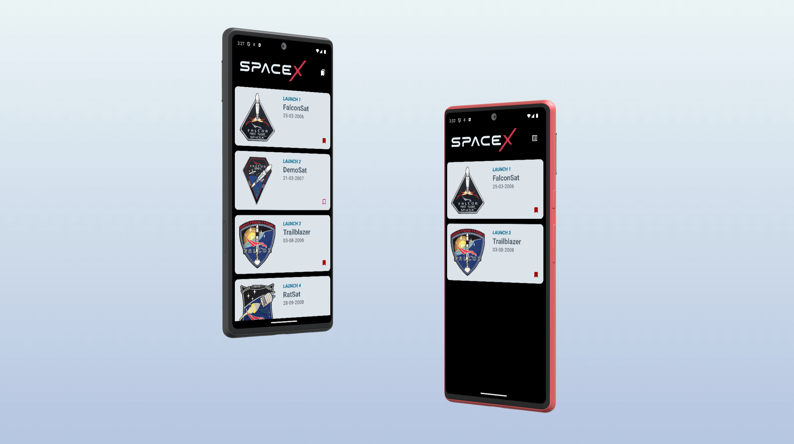

# SpaceX API Android App

An Offline first Android app to consume the SpaceX Backend API [`https://github.com/r-spacex/SpaceX-API`](https://github.com/r-spacex/SpaceX-API).

## Tech Stack

### Core

- [Kotlin](https://kotlinlang.org/)

### Dependency Injection

- [Hilt](https://dagger.dev/hilt/)

### Async Programming

- [Kotlin Coroutines](https://kotlinlang.org/docs/coroutines-overview.html)
- [Kotlin Flow](https://kotlinlang.org/docs/flow.html)

### View

- [Jetpack Compose](https://developer.android.com/jetpack/compose) (Declarative UI Framework)

### Navigation

- [Jetpack Compose Navigation](https://developer.android.com/jetpack/compose/navigation)

### Networking

- [Retrofit](https://square.github.io/retrofit/) (REST client)
- [OkHttp](https://square.github.io/okhttp/) (Networking client)
- [Gson](https://github.com/google/gson) (JSON serialization)

### Local Persistence

- [Room DB](https://developer.android.com/training/data-storage/room) (SQLite ORM)

### Image

- [Coil](https://coil-kt.github.io/coil/) (Image loading libary)

### Testing

- [Truth](https://truth.dev/) (Fluent assertions for Java and Android)
- [Junit](https://junit.org/junit4/) (Unit tests)
- [Turbine](https://github.com/cashapp/turbine) (A small testing library for kotlinx.coroutines Flow)
- [MockWebserver](https://github.com/square/okhttp/tree/master/mockwebserver) (A scriptable web server for testing HTTP clients)
- [MockK](https://mockk.io/) (mocking library for Kotlin)

## App pattern highlights

- Offline first
- Clean Architecture
- Repsository
- Usecases
- Dependency Injection
- Declarative UI
- Navigation with args
- Cacheing
- Delegation

## Project Requirements

- Java 11+
- **Android Studio Giraffe+** (for easy install use [JetBrains Toolbox](https://www.jetbrains.com/toolbox-app/))

## How to build?

1. Clone the repository
2. Open with Android Studio
3. Everything should sync and build automatically

## License

- Released under Apache License 2.0
- See [LICENSE](LICENSE) for details.
