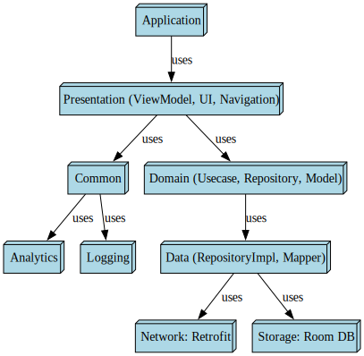

# SpaceX API Android App

An Offline first Android app to consume the SpaceX Backend API [`https://github.com/r-spacex/SpaceX-API`](https://github.com/r-spacex/SpaceX-API).

---
[](https://github.com/nisrulz/android-spacex-app/actions/workflows/run-tests.yml) [](https://github.com/nisrulz/android-spacex-app/actions/workflows/validate-gradlew.yml) [](https://github.com/nisrulz/android-spacex-app/actions/workflows/gen-android-apk.yml)


> \[!IMPORTANT]
>
> **Star the Repository**: You will receive all update notifications from GitHub without any delay \~ ⭐️

<details>
  <summary><kbd>Star History</kbd></summary>
  <picture>
    
  </picture>
</details>

## Tech Stack

### Core

- [Kotlin](https://kotlinlang.org/)

### Dependency Injection

- [Hilt](https://dagger.dev/hilt/)

### Async Programming

- [Kotlin Coroutines](https://kotlinlang.org/docs/coroutines-overview.html)
- [Kotlin Flow](https://kotlinlang.org/docs/flow.html)

### View

- [Jetpack Compose](https://developer.android.com/jetpack/compose) (Declarative UI Framework)

### Navigation

- [Jetpack Compose Navigation](https://developer.android.com/jetpack/compose/navigation)

### Networking

- [Retrofit](https://square.github.io/retrofit/) (REST client)
- [OkHttp](https://square.github.io/okhttp/) (Networking client)
- [KotlinX Serialization](https://github.com/Kotlin/kotlinx.serialization/tree/master) (JSON serialization)

### Local Persistence

- [Room DB](https://developer.android.com/training/data-storage/room) (SQLite ORM)

### Image

- [Coil](https://coil-kt.github.io/coil/) (Image loading libary)

### Testing

- [Truth](https://truth.dev/) (Fluent assertions for Java and Android)
- [Junit](https://junit.org/junit4/) (Unit tests)
- [Turbine](https://github.com/cashapp/turbine) (A small testing library for kotlinx.coroutines Flow)
- [MockWebserver](https://github.com/square/okhttp/tree/master/mockwebserver) (A scriptable web server for testing HTTP clients)
- [MockK](https://mockk.io/) (mocking library for Kotlin)

## App pattern highlights

- [Offline first](https://developer.android.com/topic/architecture/data-layer/offline-first)
- Clean Architecture
- [Repsository](https://developer.android.com/topic/architecture/data-layer)
- Usecases
- [Dependency Injection](https://developer.android.com/training/dependency-injection)
- Declarative UI
- Navigation with args
- Cacheing
- [Delegation](https://kotlinlang.org/docs/delegation.html)
- [Multibindings with Hilt](https://dagger.dev/dev-guide/multibindings.html)
- [Gradle Convention Plugins](https://docs.gradle.org/current/samples/sample_convention_plugins.html) | PR [#5](https://github.com/nisrulz/android-spacex-app/pull/5) [#7](https://github.com/nisrulz/android-spacex-app/pull/7)
- [Github Actions](https://docs.github.com/en/actions) | [Workflows used](.github/workflows)

## Dependency Graph



<br/>

> To generate this graph, simply run in the root directory.
>
> ```sh
> cd repo_assets/dependency_graph
> python3 generate_module_dependency_graph.py 
> ```

## Project Requirements

- Java 11+
- **Android Studio Giraffe+** (for easy install use [JetBrains Toolbox](https://www.jetbrains.com/toolbox-app/))

## How to build?

1. Clone the repository
2. Open with Android Studio
3. Everything should sync and build automatically

## License

- Copyright © 2023 [Nishant Srivastava](https://github.com/nisrulz).
- This project is [Apache License 2.0](./LICENSE) licensed.
