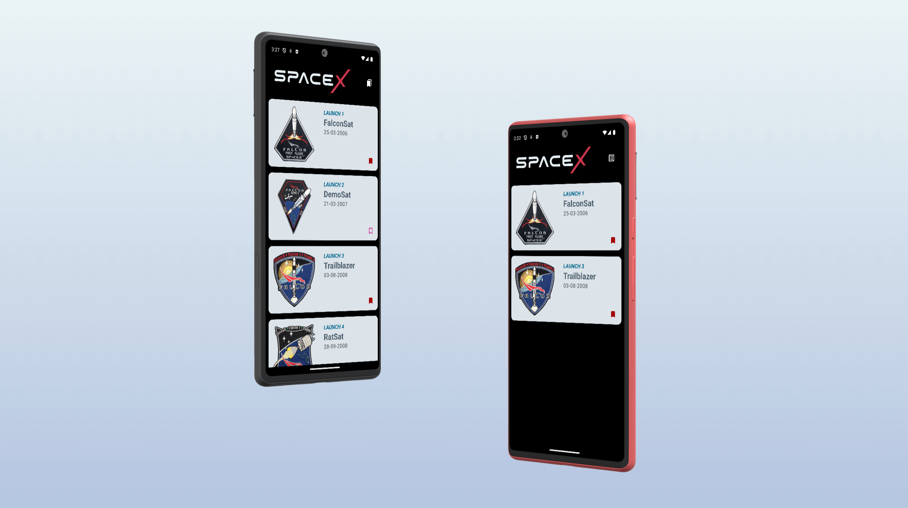

# SpaceX API Android App

An Offline first Android app to consume the SpaceX Backend API [`https://github.com/r-spacex/SpaceX-API`](https://github.com/r-spacex/SpaceX-API).

The project includes a [local Go API server](docs/api-server.md) for development and CI testing.

---
[](https://github.com/nisrulz/android-spacex-app/actions/workflows/run-tests.yml) [](https://github.com/nisrulz/android-spacex-app/actions/workflows/gen-android-apk.yml)



> \[!IMPORTANT]
>
> **Star the Repository**: You will receive all update notifications from GitHub without any delay \~ ⭐️

<details>
  <summary><kbd>Star History</kbd></summary>
  <picture>
    
  </picture>
</details>

## Documentation

- **[Architecture & Tech Stack](docs/architecture.md)** — project structure, clean architecture, module dependencies, technology choices
- **[Local API Server](docs/api-server.md)** — Go server that replaces the archived SpaceX-API, all endpoints, data sources, how to run
- **[GitHub Workflows](docs/github-workflows.md)** — CI/CD pipeline details: unit tests, APK release, Maestro UI tests with the Go server

## Project Requirements

- Go 1.22+
- Java 17+
- Android Studio

## Quick start

```sh
# Start the API server (leave running)
make start-server

# In another terminal: build, install, and launch the app
make run
```

The app connects to the Go server via `adb reverse` on `https://localhost:8443/`.

## Available commands

| Command | Description |
|---|---|
| `make start-server` | Start Go API server on `:8443` |
| `make install` | Build and install debug APK |
| `make start-app` | Launch app on connected device |
| `make stop-server` | Stop Go API server |
| `make run` | Full flow: stop → start-server → install → start-app |
| `make run-retrofit-room` | Run with Retrofit + Room (default) |
| `make run-retrofit-sqldelight` | Run with Retrofit + SQLDelight |
| `make run-ktor-room` | Run with Ktor + Room |
| `make run-ktor-sqldelight` | Run with Ktor + SQLDelight |
| `make test` | Run Android unit tests + Go server tests |
| `make lint` | Run Android lint checks |
| `make cleanup` | Delete all build artifacts |

## License

- Copyright © 2023 [Nishant Srivastava](https://github.com/nisrulz).
- This project is [Apache License 2.0](./LICENSE) licensed.
