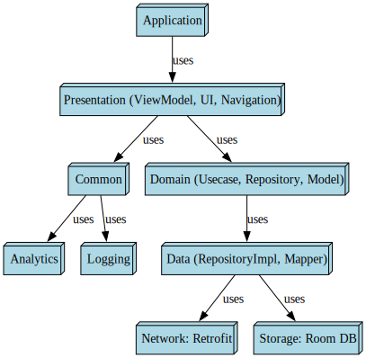

# Architecture

## Project Structure

```
android-spacex-app/
├── app/                          # Main Android application module
├── build-logic/                  # Gradle convention plugins
├── core/
│   ├── analytics/                # Analytics tracking
│   ├── common/                   # Shared utilities and base classes
│   ├── logger/                   # Logging framework
│   ├── network-retrofit/         # Retrofit networking layer, API interfaces, DTOs
│   └── storage-roomdb/           # Room database, DAOs, entities
├── data/                         # Repository layer (implements domain contracts)
├── domain/                       # Domain layer (entities, use cases, repository interfaces)
├── presentation/                 # Compose UI layer (screens, view models, navigation)
├── api-server/                   # Go HTTP server (local API replacement)
├── scripts/                      # CI/CD helper scripts
├── .github/workflows/            # GitHub Actions CI/CD definitions
├── repo_assets/                  # Images, dependency graph
└── docs/                         # Documentation
```

## Architecture Pattern: Clean Architecture + Offline First

The app follows **Clean Architecture** with an **Offline First** data strategy.

```
┌─────────────────────────────────────────────────┐
│                 Presentation                     │
│  (Jetpack Compose Screens + ViewModels)         │
│  Module: presentation/                           │
├─────────────────────────────────────────────────┤
│                   Domain                         │
│  (Use Cases, Repository Interfaces, Entities)   │
│  Module: domain/                                 │
├─────────────────────────────────────────────────┤
│                    Data                          │
│  (Repository Implementation, Data Sources)      │
│  Module: data/                                   │
├──────────────────┬──────────────────────────────┤
│   Network Source │   Local Source               │
│   (Retrofit)     │   (Room DB)                  │
│   core/network-  │   core/storage-roomdb/       │
│   retrofit/      │                              │
└──────────────────┴──────────────────────────────┘
```

### Data flow

1. **Repository** (in `data/`) implements domain-layer interfaces
2. On data request, repository returns cached data from **Room DB** immediately
3. Simultaneously, it fetches fresh data from the **network** (Retrofit → Go API server)
4. Network response is saved to Room DB and emitted to the UI via `Flow`
5. UI observes the `Flow` from the repository and renders the current state

### API server integration

The upstream `r-spacex/SpaceX-API` was archived. A [local Go API server](../docs/api-server.md) in `api-server/` replaces it, serving all original endpoints from embedded static data.

**Connection flow:**

```
Android app
  → okhttp3 (core/network-retrofit/)
    → Retrofit (SpaceXLaunchesApi interface)
      → HTTP GET https://<host>:8443/v5/launches
        → Go API server (api-server/) ← auto-detects certs/ for TLS
```

- **Base URL** is configured via `BuildConfig.API_BASE_URL` (set in `core/network-retrofit/build.gradle.kts`, overridable with `-PAPI_BASE_URL`)
- **TLS**: the server uses a self-signed cert in `certs/`. The Android app embeds the same cert at `app/src/main/res/raw/server.crt` and trusts it via `network_security_config.xml`
- **Emulator dev**: the app connects via `adb reverse tcp:8443 tcp:8443` → `https://localhost:8443/`. Alternatively, `10.0.2.2:8443` reaches the host directly
- **Physical device / CI**: override the URL to the host's LAN IP (e.g. `-PAPI_BASE_URL=https://192.168.1.100:8443/`)

### Module dependencies

```
app → presentation → data → domain
                      ↓         ↑
                 core/network-retrofit
                 core/storage-roomdb
                 core/common
                 core/analytics
                 core/logger
```

### Dependency Graph



> To generate this graph, run from the root directory:
>
> ```sh
> cd repo_assets/dependency_graph
> python3 generate_module_dependency_graph.py
> ```

## Tech Stack

### Language
- [Kotlin](https://kotlinlang.org/)

### Dependency Injection
- [Hilt](https://dagger.dev/hilt/)

### Async Programming
- [Kotlin Coroutines](https://kotlinlang.org/docs/coroutines-overview.html)
- [Kotlin Flow](https://kotlinlang.org/docs/flow.html)

### View
- [Jetpack Compose](https://developer.android.com/jetpack/compose) (Declarative UI Framework)

### Navigation
- [Jetpack Compose Navigation](https://developer.android.com/jetpack/compose/navigation)

### Networking
- [Retrofit](https://square.github.io/retrofit/) (REST client)
- [OkHttp](https://square.github.io/okhttp/) (Networking client)
- [KotlinX Serialization](https://github.com/Kotlin/kotlinx.serialization/tree/master) (JSON serialization)

### Local Persistence
- [Room DB](https://developer.android.com/training/data-storage/room) (SQLite ORM)

### Image
- [Coil](https://coil-kt.github.io/coil/) (Image loading libary)

### Testing
- [Truth](https://truth.dev/) (Fluent assertions for Java and Android)
- [Junit](https://junit.org/junit4/) (Unit tests)
- [Turbine](https://github.com/cashapp/turbine) (A small testing library for kotlinx.coroutines Flow)
- [MockWebserver](https://github.com/square/okhttp/tree/master/mockwebserver) (A scriptable web server for testing HTTP clients)
- [MockK](https://mockk.io/) (mocking library for Kotlin)

### API Server (Go)
- [Go 1.22](https://go.dev/) — standalone HTTP server
- **Standard Library** — zero external dependencies (`net/http`, `encoding/json`, `embed`)
- **Static data** — all data embedded at compile time via `//go:embed`

## App Pattern Highlights

- [Offline first](https://developer.android.com/topic/architecture/data-layer/offline-first) — cache then network data strategy
- [Clean Architecture](https://developer.android.com/topic/architecture) — `domain/` → `data/` → `presentation/` layers
- [Repository Pattern](https://developer.android.com/topic/architecture/data-layer) — `data/` implements `domain/` interfaces
- [Use Cases](https://developer.android.com/topic/architecture/domain-layer) — single-responsibility interactors in `domain/`
- [Dependency Injection](https://developer.android.com/training/dependency-injection) — constructor injection via Hilt
- [Declarative UI](https://developer.android.com/jetpack/compose) — Jetpack Compose throughout
- [Type Safe Navigation](https://github.com/nisrulz/android-spacex-app/pull/37) — Compose Navigation with serializable route args
- [Delegation](https://kotlinlang.org/docs/delegation.html) — Kotlin `by` keyword for delegation patterns
- [Multibindings with Hilt](https://dagger.dev/dev-guide/multibindings.html) — pluggable module contributions
- [Convention Plugins](https://github.com/nisrulz/android-spacex-app/pull/29/commits/2e05a6c3fa972cd29c89a28cb5a735aa073d4f43) — `build-logic/` for shared Gradle config
- [Caching](https://developer.android.com/topic/architecture/data-layer/offline-first) — Room DB for offline-first, OkHttp for network cache
- [GitHub Actions](https://docs.github.com/en/actions) | [Workflows used](.github/workflows) — CI/CD pipeline

## Build System

- **Gradle** with Kotlin DSL
- **Version Catalog** (`libs.versions.toml`) for centralized dependency management
- **Convention Plugins** (`build-logic/`) for reusable module configuration
- **Jacoco** for test coverage
- **R8/ProGuard** for release minification
